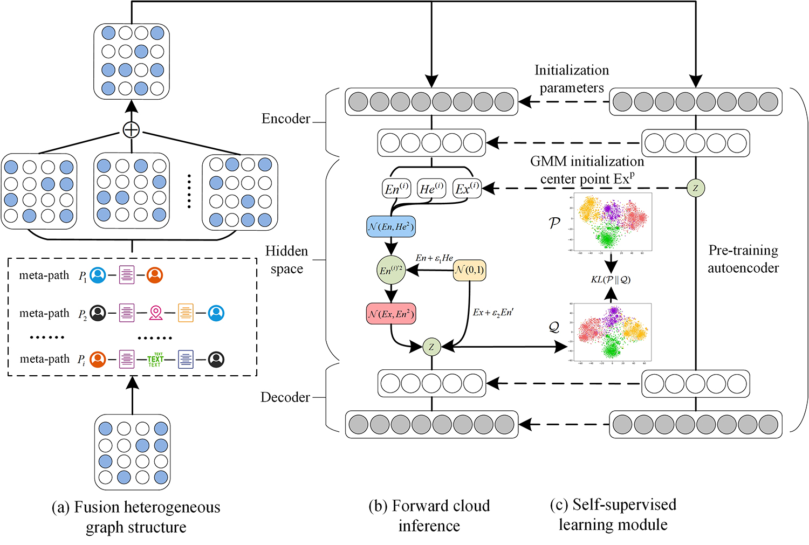

## HNECV



This repository provides a reference implementation of *HNECV* as described in the paper:

```
HNECV: Heterogeneous Network Embedding via Cloud model and Variational inference.
Ming Yuan, LiuQun, Guoyin Wang, Yike Guo.
CAAI International Conference on Artificial Intelligence. 2021.
```

The paper has been accepted by CICAI, available at [here](HNECV.pdf) and [SpringLink](https://link.springer.com/chapter/10.1007/978-3-030-93046-2_63)

### Dataset

The processed data used in the paper are available at:

- DBLP - [Dropbox](https://www.dropbox.com/s/zpvkz0bsvepzuqm/SingleDBLP.mat?dl=0)
- AMiner - [Dropbox](https://www.dropbox.com/s/p7r4s0llqnsw7es/SingleAminer.mat?dl=0)
- Yelp - [Dropbox](https://www.dropbox.com/s/whowte4f4zsu86r/SingleYelp.mat?dl=0)

You need to perform the following steps for the downloaded file: 

- Move `SingleDBLP.mat` to the `HNECV/dataset/DBLP/`
- Move `SingleAminer.mat` to the `HNECV/dataset/AMiner/`
- Move `SingleYelp.mat` to the `HNECV/dataset/Yelp/`

### Basic Usage

If you only want to train the model, you need to specify a certain data set, such as dblp, aminer, yelp

```python
python pytorch_HNECV.py --dataset dblp
```

If you want to understand all the processes of the model, you can execute the following command

```python
python pipline.py --dataset dblp
```

> noted: You can adjust the hyperparameters in pytorch_HNECV.py or pipeline.py according to your needs

### Requirements

- Python ≥ 3.6
- PyTorch ≥ 1.7.1
- scipy ≥ 1.5.2
- scikit-learn ≥ 0.21.3
- tqdm ≥ 4.31.1
- numpy
- pandas
- matplotlib

### How to use your own data set

Your input file must be a adjacency matrix, which can be a **mat** file or other compressed format

If you only have the **edgelist** file, you need to follow the preprocessing method in pipline.py, and rewrite the corresponding semantic random walk code.

> noted: If you run pytorch_HNECV.py directly, You need at least the label file of the node, like the initial file in the `dataset/DBLP/reindex_dblp/` folder

### Citing

If HNECV is useful for your research, please cite the following paper:

```
@inproceedings{DBLP:conf/cicai/YuanLWG21,
  author    = {Ming Yuan and
               Qun Liu and
               Guoyin Wang and
               Yike Guo},
  editor    = {Lu Fang and
               Yiran Chen and
               Guangtao Zhai and
               Z. Jane Wang and
               Ruiping Wang and
               Weisheng Dong},
  title     = {{HNECV:} Heterogeneous Network Embedding via Cloud Model and Variational
               Inference},
  booktitle = {Artificial Intelligence - First {CAAI} International Conference, {CICAI}
               2021, Hangzhou, China, June 5-6, 2021, Proceedings, Part {I}},
  series    = {Lecture Notes in Computer Science},
  volume    = {13069},
  pages     = {747--758},
  publisher = {Springer},
  year      = {2021},
  url       = {https://doi.org/10.1007/978-3-030-93046-2\_63},
  doi       = {10.1007/978-3-030-93046-2\_63},
  timestamp = {Fri, 14 Jan 2022 09:56:35 +0100},
  biburl    = {https://dblp.org/rec/conf/cicai/YuanLWG21.bib},
  bibsource = {dblp computer science bibliography, https://dblp.org}
}
```
